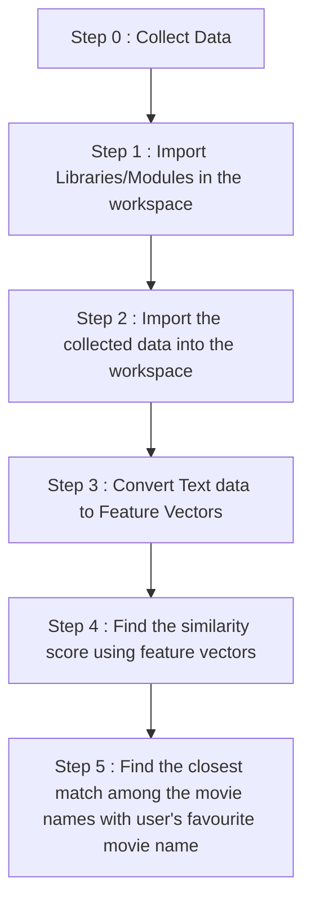

# Podcast Recommendation System using <strong>Content Based Filtering</strong>

This is a <bold>PODCAST RECOMMENDATION SYSTEM</bold> which recommends podcasts after taking input of a favourite podcast name from you.

<h2 align='center'>WORKFLOW OF THE PROJECT</h2>

## In collaboration with <a href="https://github.com/kunalkeshan">Kunal Keshan</a>

### For complaints or compliments : 
### Connect me on : dvamsidhar2002@gmail.com
